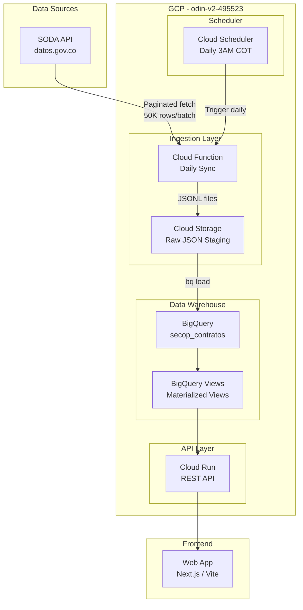

# Odin v2 — Plataforma de Inteligencia en Contratación Pública

Plataforma basada en datos abiertos de SECOP II (5.6M+ contratos) con tres líneas de producto: observatorio público de corrupción, observatorio privado de gasto para entidades, y herramienta de análisis de mercado para proveedores.

## Arquitectura Propuesta

---

## Análisis de Costos Detallado (Mensual)

### Datos del Dataset
| Métrica | Valor |
|---|---|
| Total registros | 5,614,448 |
| Columnas | 84 |
| Tamaño estimado por registro (JSON) | ~3.5 KB |
| Tamaño total crudo (JSON) | ~19.6 GB |
| Tamaño en BigQuery (columnar, comprimido) | ~8-12 GB |
| Registros nuevos diarios (estimado) | ~5,000-15,000 |

### BigQuery

| Concepto | Cálculo | Costo/Mes |
|---|---|---|
| **Almacenamiento activo** (primeros 90 días) | 12 GB × $0.02/GB | **$0.24** |
| **Almacenamiento largo plazo** (después de 90 días) | 12 GB × $0.01/GB | **$0.12** |
| **Consultas on-demand** | ~50 queries/día × 12GB × $6.25/TB | **$112** ⚠️ |
| **Consultas con partitioning+clustering** | ~50 queries/día × ~0.5GB scanned × $6.25/TB | **$4.70** ✅ |

> [!TIP]
> Con **particionamiento por fecha** y **clustering por departamento/entidad**, cada consulta escanea solo ~0.5GB en lugar de 12GB. Esto reduce el costo de queries de $112 a **~$5/mes**.

### Cloud Storage (Staging)

| Concepto | Cálculo | Costo/Mes |
|---|---|---|
| Almacenamiento temporal | ~1 GB (se borra después de carga) | **$0.02** |

### Cloud Functions (Ingestion Pipeline)

| Concepto | Cálculo | Costo/Mes |
|---|---|---|
| **Carga inicial** (una vez) | ~113 invocaciones × 512MB × ~5min | **$0.50** (una vez) |
| **Sync diario** | 30 ejecuciones × 512MB × ~2min | **$0.30** |

### Cloud Scheduler

| Concepto | Cálculo | Costo/Mes |
|---|---|---|
| 1 job diario | 3 jobs gratis/cuenta | **$0.00** |

### Cloud Run (API - futuro)

| Concepto | Cálculo | Costo/Mes |
|---|---|---|
| API REST | CPU on-demand, ~1000 req/día estimado | **$2-5** |

### 💰 Resumen de Costos

| Escenario | Costo Mensual |
|---|---|
| **Sin optimización** (full table scan cada query) | ~$115/mes |
| **Con partitioning + clustering** (recomendado) | **~$7-10/mes** ✅ |
| **Free tier BigQuery** (1TB gratis/mes de queries) | **~$0.50/mes** 🎉 |

> [!IMPORTANT]
> **BigQuery ofrece 1 TB de consultas GRATIS por mes y 10 GB de almacenamiento gratis.** Con la optimización de partitioning, las 50 queries/día escanearían ~15 GB/mes, muy por debajo del 1 TB gratuito. **En la práctica, el costo podría ser casi $0 en la etapa inicial.**

---

## Proposed Changes

### Phase 1: Data Ingestion Pipeline (HOY)

#### Estructura BigQuery

- **Dataset**: `secop`
- **Tabla principal**: `secop.contratos_electronicos`
  - Particionada por `fecha_de_firma` (tipo DATE, granularidad mensual)
  - Clusterizada por `departamento`, `nombre_entidad`, `estado_contrato`
- **Vista materializada**: `secop.v_resumen_departamento` (KPIs por departamento)
- **Vista materializada**: `secop.v_resumen_entidad` (KPIs por entidad)

#### [NEW] `ingestion/initial_load.py`
Script Python para carga inicial de los 5.6M de registros:
- Paginación SODA API con `$limit=50000` y `$offset`
- Escritura a archivos JSONL en Cloud Storage
- Carga a BigQuery via `bq load`
- Manejo de reintentos y logging de progreso

#### [NEW] `ingestion/daily_sync.py`  
Script Python para sincronización diaria incremental:
- Filtra por `$where=ultima_actualizacion > '{last_sync_date}'`
- UPSERT en BigQuery usando `MERGE` por `id_contrato`
- Registro de última fecha de sincronización

#### [NEW] `ingestion/schema.sql`
Definición del esquema BigQuery con tipos optimizados:
- Campos numéricos: `NUMERIC` para valores monetarios (COP)
- Campos fecha: `DATE` / `TIMESTAMP`
- Campos texto: `STRING`
- Partitioning y clustering config

#### [NEW] `ingestion/requirements.txt`
Dependencias: `google-cloud-bigquery`, `google-cloud-storage`, `requests`

---

### Phase 2: Vistas Analíticas (Después de ingesta)

Vistas materializadas para las tres líneas de producto:

1. **Observatorio de Corrupción**: Indicadores de riesgo (contratos con sobrecostos, tiempos atípicos, concentración en proveedores)
2. **Observatorio de Gasto**: KPIs por entidad, ejecución presupuestal, tendencias
3. **Análisis de Mercado**: Contratos por categoría UNSPSC, requisitos por modalidad, histórico de proveedores ganadores

### Phase 3: API + Frontend (Siguiente conversación)

---

## Open Questions

> [!IMPORTANT]
> **1. ¿Tienes billing habilitado en el proyecto `odin-v2-495523`?** BigQuery requiere una cuenta de facturación vinculada, aunque el free tier cubre la gran mayoría del uso inicial.

> [!IMPORTANT]  
> **2. ¿Quieres que arranquemos hoy solo con la ingesta (Phase 1)?** Puedo crear el pipeline completo y ejecutar la carga inicial de los 5.6M registros. Las fases 2 y 3 las abordamos después.

> [!NOTE]
> **3. Repositorio GitHub**: El repo `marioarevalo-agent/Odin-v2` está vacío. ¿Quieres que suba todo el código allí o prefieres trabajar local primero?

## Verification Plan

### Automated Tests
- Verificar que BigQuery dataset y tabla se crean correctamente
- Ejecutar carga de prueba con 1,000 registros y validar esquema
- Consultar conteo total post-carga vs API (`5,614,448`)
- Probar query de ejemplo con partitioning para validar costos

### Manual Verification
- Revisar datos en la consola de BigQuery
- Ejecutar queries de ejemplo para cada línea de producto
